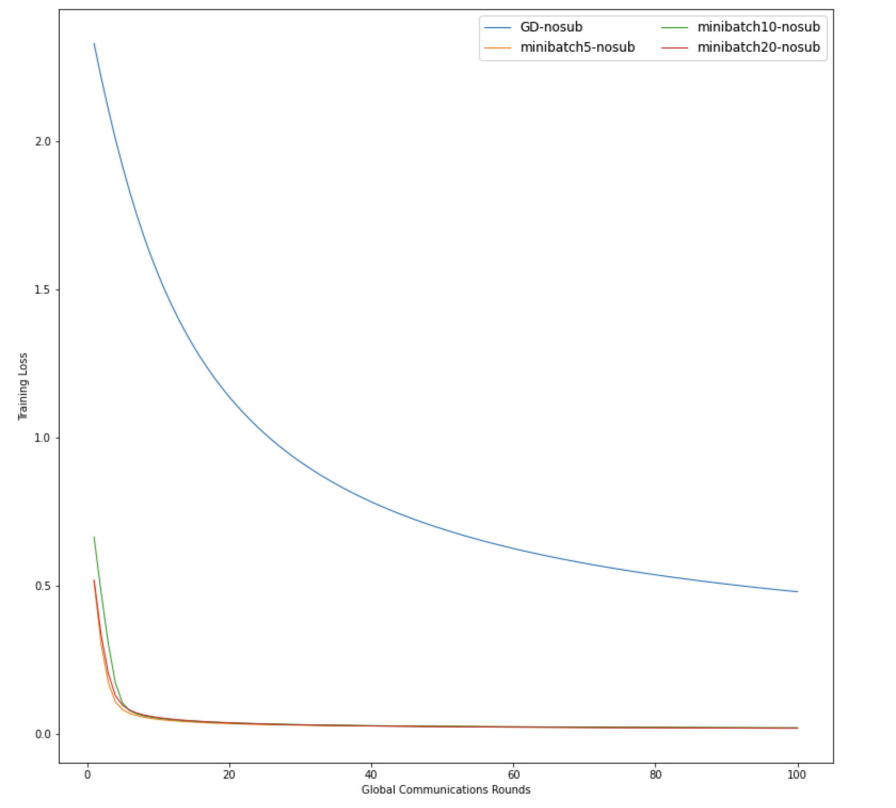

# Appendix

**Figure 1: gd-vs-minibatch-accuracy**:

**Figure 2: only-minibatch-accuracy**:

**Figure 3: gd-vs-minibatch-loss**:

**Figure 4: sub-vs-nonsub-accuracy**:

**Figure 5: sub-vs-nonsub-loss**:

